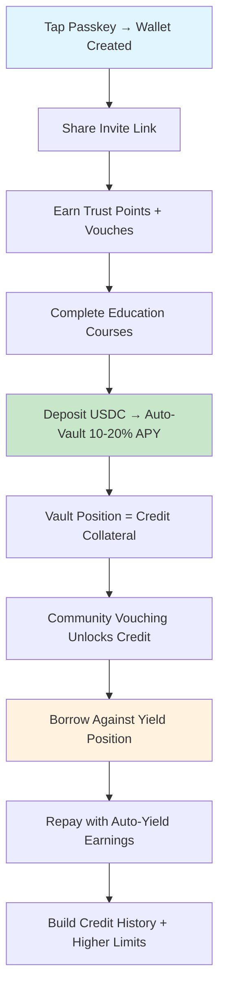

# Credit System

Sozu Capital's credit system represents a revolutionary approach to decentralized finance, combining community-based trust, automated yield generation, and seamless user experience through our innovative auto-deposit logic.

## Overview

Sozu Credit revolutionizes access to credit by eliminating traditional barriers while leveraging cutting-edge DeFi infrastructure. Our system combines:

- **Passkey Authentication**: Biometric security with zero-password UX
- **Instant Stellar Wallets**: Self-custodial wallets created in milliseconds
- **Auto-Deposit Yield Vaults**: Automatic 10-20% APY generation on USDC deposits
- **Community Trust Network**: Decentralized vouching system replacing credit scores
- **Education Gateway**: Financial literacy courses unlocking credit eligibility
- **Blend Protocol Integration**: Institutional-grade lending with overcollateralization

## The Sozu Wallet

### Smart Wallet Creation

Every Sozu Capital user receives a **Sozu Wallet** - a self-custodial Stellar wallet created instantly upon registration using passkey authentication.

**Key Features:**

- **Passkey Authentication**: Biometric login with no passwords to remember or store
- **Instant Creation**: Wallet generated in milliseconds using Turnkey's secure infrastructure
- **Multi-Asset Support**: Native support for USDC and other Stellar assets
- **Self-Custody**: Private keys encrypted and managed by the user

**Technical Implementation:**

```typescript
// Turnkey wallet creation with passkey authentication
import { TurnkeyClient } from "@turnkey/sdk-server";

const turnkeyClient = new TurnkeyClient({
  apiBaseUrl: process.env.NEXT_PUBLIC_TURNKEY_API_BASE_URL,
  apiPublicKey: process.env.NEXT_PUBLIC_TURNKEY_API_PUBLIC_KEY,
  apiPrivateKey: process.env.TURNKEY_API_PRIVATE_KEY,
  defaultOrganizationId: process.env.NEXT_PUBLIC_TURNKEY_ORG_ID,
});

// Create wallet instantly on user registration
const wallet = await turnkeyClient.createWallet({
  walletName: `SozuWallet_${userId}`,
  accounts: [
    {
      curve: "ed25519",
      pathFormat: "BIP32",
      path: "m/44'/148'/{accountIndex}'", // Stellar path
      addressFormat: "STELLAR",
    },
  ],
});
```

### Auto-Deposit Vault Logic

The revolutionary **auto-deposit vault system** automatically maximizes yield while maintaining instant liquidity for credit operations.

**How It Works:**

1. **Smart Deposit Detection**: Monitors Stellar Horizon API for incoming USDC transfers
2. **Instant Vault Allocation**: 90% of funds automatically deposited to Blend yield vaults
3. **Liquidity Reserve**: 10% maintained in hot wallet for immediate credit access
4. **Real-Time Balance Sync**: Aggregates wallet + vault balances for unified user experience
5. **Dynamic Rebalancing**: Automatically adjusts allocations based on yield rates and liquidity needs

**Yield Optimization:**

```typescript
// Auto-deposit vault allocation logic
const VAULT_MIN_DEPOSIT = 10; // Minimum USDC for vault deposit

function processIncomingUSDC(amount: number) {
  const vaultAmount = Math.max(amount * 0.9, VAULT_MIN_DEPOSIT);
  const reserveAmount = amount - vaultAmount;

  // Deposit to Blend vault for 10-20% APY
  await blendVault.deposit(vaultAmount);

  // Maintain liquidity reserve
  await stellarWallet.reserve(reserveAmount);

  // Update unified balance
  await updateUserBalance(userId, {
    wallet: reserveAmount,
    vault: vaultAmount,
    totalYield: calculateProjectedYield(vaultAmount),
  });
}
```

**Benefits:**

- **Passive 10-20% APY**: Automatic yield generation with zero user effort
- **Instant Liquidity**: Credit operations draw from reserve without vault withdrawal delays
- **Unified Balance View**: Single balance showing combined wallet + vault value
- **Risk Management**: Overcollateralized vault positions with impermanent loss protection

## Blend Protocol Integration

### What is Blend?

[Blend Protocol](https://docs.blend.capital/) is Stellar's premier lending protocol, offering:

- **Overcollateralized Lending**: Users deposit assets as collateral to borrow others
- **Liquidity Pools**: Automated market making with impermanent loss protection
- **High-Yield Opportunities**: Competitive APYs through strategic liquidity provision
- **Trust-Minimized**: Smart contracts ensure protocol integrity

### Blend Vault Integration

Sozu Credit integrates with **Blend Protocol** for institutional-grade yield generation with enterprise-level security.

**Vault Configuration:**

```typescript
// Environment configuration
const BLEND_CONFIG = {
  network: process.env.STELLAR_NETWORK || "testnet",
  horizonUrl: process.env.STELLAR_HORIZON_URL,
  usdcAsset: {
    code: "USDC",
    issuer: "GA5ZSEJYB37JRC5AVCIA5MOP4RHTM335X2KGX3IHOJAPP5RE34K4KZVN",
  },
  vaultProtocol: process.env.VAULT_PROTOCOL || "blend",
  minDeposit: parseInt(process.env.VAULT_MIN_DEPOSIT) || 10,
};
```

**Vault Operations:**

```typescript
// Deposit to Blend vault for yield generation
async function depositToBlendVault(userId: string, amount: number) {
  const stellarAccount = await turnkeyClient.getStellarAccount(userId);

  // Create trustline for Blend LP tokens if needed
  await createBlendTrustline(stellarAccount);

  // Deposit USDC to Blend vault
  const depositTx = await blendSdk.buildDepositTx({
    from: stellarAccount.publicKey,
    amount: amount,
    asset: BLEND_CONFIG.usdcAsset,
  });

  // Sign and submit transaction
  const signedTx = await turnkeyClient.signTransaction(depositTx, userId);
  const result = await stellarSdk.submitTransaction(signedTx);

  return result;
}
```

**Yield Tracking & Balance Aggregation:**

```typescript
// Real-time balance aggregation (wallet + vault)
async function getUnifiedBalance(userId: string) {
  const [walletBalance, vaultPosition] = await Promise.all([
    stellarSdk.getBalance(userId), // Hot wallet USDC
    blendSdk.getVaultPosition(userId), // Vault LP tokens + accrued yield
  ]);

  // Convert vault position to USD value
  const vaultValueUSD = await blendSdk.getPositionValue(vaultPosition);
  const accruedYield = await blendSdk.getAccruedYield(vaultPosition);

  return {
    totalBalance: walletBalance + vaultValueUSD,
    walletReserve: walletBalance,
    vaultPosition: vaultValueUSD,
    accruedYield: accruedYield,
    projectedAPY: await blendSdk.getCurrentAPY(),
  };
}
```

### Collateralization Mechanics

Blend's overcollateralized lending ensures system stability:

**Collateral Requirements:**

- **Minimum Ratio**: 110% collateralization for borrowing
- **Liquidation Threshold**: 105% triggers position adjustment
- **Interest Rates**: Dynamic based on utilization and market conditions

**Sozu Credit Integration:**

```typescript
// Credit pool collateral structure
interface CreditCollateral {
  userDeposits: {
    usdc: amount; // User's deposited USDC
    blendLP: lpTokens; // Strategy LP tokens
    yieldEarnings: accrued; // Accumulated yield
  };

  creditTerms: {
    maxLoanToValue: 0.8; // 80% LTV ratio
    interestRate: dynamic; // Based on trust score
    repaymentPeriod: 30; // Days
  };
}
```

## Perfect Fit for Sozu Capital

### Low-Friction User Experience

**Traditional DeFi Problems Solved:**

- **Complex Interfaces**: Blend's Strategy LPs abstracted behind simple auto-deposit
- **Manual Management**: Automated rebalancing and position management
- **High Minimums**: Micro-deposits supported through aggregation
- **Technical Barriers**: No blockchain knowledge required

### Trust-Based Credit Enhancement

**Yield = Credit Collateral:**

- **Automatic Accumulation**: Every user builds collateral through passive yield
- **Trust Score Multiplier**: Community vouching determines credit terms
- **Education Requirements**: Knowledge verification unlocks higher limits

### Risk Mitigation

**Multi-Layered Security:**

- **Overcollateralization**: Blend's 110% minimum ensures solvency
- **Yield Insurance**: Strategy LPs include impermanent loss protection
- **Community Oversight**: Vouching system prevents reckless lending
- **Self-Custody**: Users control their assets at all times

## User Journey

### Sozu Credit User Flow

**New User Onboarding:**

1. **Biometric Registration**: Tap fingerprint/face ID → Instant wallet creation
2. **Get Invite Link**: Share with community → Earn initial trust points
3. **Receive USDC**: Funds auto-deposit to yield vault → Start earning 10-20% APY
4. **Complete Education**: Learn DeFi basics → Unlock credit eligibility
5. **Build Trust Network**: Get vouched by community → Higher credit limits
6. **Access Credit**: Borrow against vault position → Transparent terms

**Daily User Experience:**

1. **View Unified Balance**: Wallet reserve + vault position + accrued yield
2. **Track Real-Time APY**: Live yield calculations from Blend vaults
3. **Vouch for Others**: Build reputation → Better credit terms
4. **Send/Receive Instantly**: Stellar network transfers with auto-vault deposits
5. **Manage Credit**: View terms, make repayments, monitor trust score

### Credit Operations Flow



## Technical Architecture

### Sozu Credit Tech Stack

**Frontend Layer:**

- **Next.js 14+ App Router**: Modern React framework with server components
- **TypeScript**: Full type safety across the application
- **Tailwind CSS**: Utility-first styling for rapid UI development
- **PWA Support**: Offline-first experience with service workers
- **WebAuthn/Passkeys**: Native biometric authentication

**Backend Layer:**

- **Next.js API Routes**: Edge runtime for optimal performance
- **Supabase**: PostgreSQL database with real-time subscriptions
- **Turnkey SDK**: Enterprise-grade wallet security and key management
- **Stellar SDK**: Native integration with Stellar network
- **Blend SDK**: DeFi protocol integration for yield generation

**Blockchain Layer:**

- **Stellar Network**: Fast, low-cost blockchain for financial operations
- **USDC Asset**: Circle's USD stablecoin on Stellar
- **Blend Protocol**: Institutional lending and yield infrastructure

### Architecture Diagram

```
┌─────────────────────────────────────────────────────────────┐
│                    Frontend (Next.js PWA)                   │
│  ┌───────────────────────────────────────────────────────┐  │
│  │  • Passkeys Auth (WebAuthn)                           │  │
│  │  • Stellar Wallet UI                                  │  │
│  │  • Blend Vault Dashboard                              │  │
│  │  • Trust Points & Vouching System                     │  │
│  │  • Education Portal                                   │  │
│  │  • Real-time Balance Aggregation                      │  │
│  └───────────────────────────────────────────────────────┘  │
└─────────────────────┬───────────────────────────────────────┘
                      │
┌─────────────────────▼───────────────────────────────────────┐
│               API Layer (Next.js Edge Runtime)              │
│  ┌───────────────────────────────────────────────────────┐  │
│  │  • Wallet Management (Turnkey)                        │  │
│  │  • Vault Operations (Blend)                           │  │
│  │  • Trust Points API                                   │  │
│  │  • Education Progress Tracking                        │  │
│  │  • Stellar Horizon Integration                        │  │
│  │  • Balance Aggregation Service                        │  │
│  └───────────────────────────────────────────────────────┘  │
└─────────────────────┬───────────────────────────────────────┘
                      │
┌─────────────────────▼───────────────────────────────────────┐
│                Database Layer (Supabase)                    │
│  ┌───────────────────────────────────────────────────────┐  │
│  │  • User Profiles & Passkey Credentials                │  │
│  │  • Wallet Addresses & Vault Positions                 │  │
│  │  • Trust Points & Vouch Relationships                 │  │
│  │  • Education Progress & Certifications                │  │
│  │  • Transaction History & Credit Ledger                │  │
│  └───────────────────────────────────────────────────────┘  │
└─────────────────────┬───────────────────────────────────────┘
                      │
┌─────────────────────▼───────────────────────────────────────┐
│             Stellar Blockchain + Blend Protocol             │
│  ┌───────────────────────────────────────────────────────┐  │
│  │  • Smart Wallets (Turnkey-managed)                    │  │
│  │  • USDC Asset Management                              │  │
│  │  • Blend Vault Positions (10-20% APY)                 │  │
│  │  • Lending Pool Integration                           │  │
│  │  • Transaction Settlement                              │  │
│  └───────────────────────────────────────────────────────┘  │
└─────────────────────────────────────────────────────────────┘
```

### Auto-Deposit Implementation

**Real-time Balance Monitoring:**

```typescript
// Horizon API integration for transaction monitoring
const horizon = new StellarSdk.Server(BLEND_CONFIG.horizonUrl);

async function monitorDeposits(userId: string) {
  const userWallet = await getUserWallet(userId);

  // Stream incoming payments
  const paymentStream = horizon
    .payments()
    .forAccount(userWallet.publicKey)
    .cursor("now")
    .stream({
      onmessage: async (payment) => {
        if (
          payment.type === "payment" &&
          payment.asset_code === "USDC" &&
          payment.to === userWallet.publicKey
        ) {
          await processIncomingUSDC(userId, parseFloat(payment.amount));
        }
      },
    });

  return paymentStream;
}
```

**Unified Balance Service:**

```typescript
// Real-time balance aggregation across wallet + vault
export async function getAggregatedBalance(userId: string) {
  const [walletData, vaultData, trustScore] = await Promise.all([
    getWalletBalance(userId),
    getVaultPosition(userId),
    getUserTrustScore(userId),
  ]);

  return {
    wallet: {
      usdc: walletData.usdc,
      address: walletData.address,
    },
    vault: {
      position: vaultData.position,
      accruedYield: vaultData.accruedYield,
      apy: vaultData.apy,
    },
    credit: {
      available: calculateCreditLimit(vaultData.position, trustScore),
      trustScore: trustScore,
      nextVouchBonus: calculateVouchBonus(trustScore),
    },
    total: walletData.usdc + vaultData.position + vaultData.accruedYield,
  };
}
```

## Benefits for Users

### Financial Inclusion

- **No Credit History Required**: Trust-based system replaces traditional scores
- **Low Barriers**: Start with any amount, build gradually
- **Education Focus**: Financial literacy as credit prerequisite

### Superior Returns

- **Automated Optimization**: Always earning maximum available yield
- **Compound Growth**: Yield on yield through continuous reinvestment
- **Low Risk**: Institutional-grade DeFi strategies with user-friendly interface

### Seamless Experience

- **One-Click Operations**: Deposit, borrow, repay with single actions
- **Real-Time Transparency**: Live balance and yield tracking
- **Mobile-First**: PWA design for on-the-go access

## Future Enhancements

### Advanced Strategies

- **Multi-Protocol Integration**: Additional DeFi protocols for enhanced yields
- **AI Optimization**: Machine learning for optimal deposit timing
- **Cross-Chain Expansion**: Multi-blockchain yield opportunities

### Enhanced Credit Features

- **Dynamic Terms**: AI-adjusted rates based on user behavior
- **Flash Loans**: Instant credit for arbitrage opportunities
- **Credit Derivatives**: Tradable credit instruments

---

**Ready to experience the future of credit?** Join Sozu Capital and discover how community trust + automated yield creates the most accessible credit system ever built.
