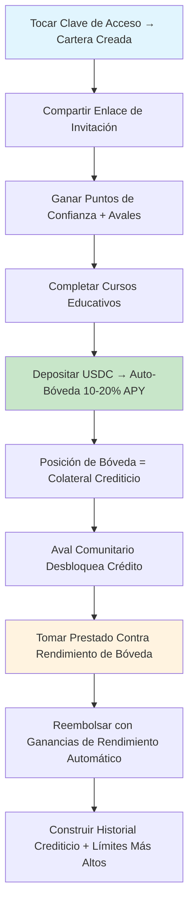

# Sistema de Crédito

Sozu Credit revoluciona el acceso al crédito eliminando las barreras tradicionales mientras aprovecha una infraestructura DeFi de vanguardia. Nuestro sistema combina:

- **Autenticación con claves de acceso**: Seguridad biométrica con UX sin contraseñas
- **Carteras Stellar instantáneas**: Carteras auto-custodiadas creadas en milisegundos
- **Bóvedas de rendimiento con depósito automático**: Generación automática de rendimiento del 10-20% APY en depósitos USDC
- **Red de confianza comunitaria**: Sistema de aval descentralizado que reemplaza los puntajes de crédito
- **Portal educativo**: Cursos de alfabetización financiera que desbloquean la elegibilidad crediticia
- **Integración del protocolo Blend**: Préstamo institucional con sobrecolateralización

## La Cartera Sozu

### Creación Inteligente de Cartera

Cada usuario de Sozu Capital recibe una **Cartera Sozu** - una cartera Stellar auto-custodiada creada instantáneamente al registrarse usando autenticación con clave de acceso.

**Características Clave:**

- **Autenticación con claves de acceso**: Inicio de sesión biométrico sin contraseñas que recordar o almacenar
- **Creación Instantánea**: Cartera generada en milisegundos usando la infraestructura segura de Turnkey
- **Soporte Multi-Activo**: Soporte nativo para USDC y otros activos Stellar
- **Auto-Custodia**: Claves privadas encriptadas y administradas por el usuario

**Implementación Técnica:**

```typescript
// Creación de cartera Turnkey con autenticación de clave de acceso
import { TurnkeyClient } from "@turnkey/sdk-server";

const turnkeyClient = new TurnkeyClient({
  apiBaseUrl: process.env.NEXT_PUBLIC_TURNKEY_API_BASE_URL,
  apiPublicKey: process.env.NEXT_PUBLIC_TURNKEY_API_PUBLIC_KEY,
  apiPrivateKey: process.env.TURNKEY_API_PRIVATE_KEY,
  defaultOrganizationId: process.env.NEXT_PUBLIC_TURNKEY_ORG_ID,
});

// Crear cartera instantáneamente al registrarse el usuario
const wallet = await turnkeyClient.createWallet({
  walletName: `SozuWallet_${userId}`,
  accounts: [
    {
      curve: "ed25519",
      pathFormat: "BIP32",
      path: "m/44'/148'/{accountIndex}'", // Ruta Stellar
      addressFormat: "STELLAR",
    },
  ],
});
```

### Lógica de Bóveda con Depósito Automático

El sistema revolucionario de **bóveda con depósito automático** optimiza automáticamente los fondos para rendimiento máximo mientras mantiene liquidez instantánea para operaciones crediticias.

**Cómo Funciona:**

1. **Detección Inteligente de Depósitos**: Monitoreo de la API Stellar Horizon para transferencias USDC entrantes
2. **Asignación Instantánea a Bóveda**: 90% de los fondos depositados automáticamente en bóvedas de rendimiento Blend
3. **Reserva de Liquidez**: 10% mantenido en cartera caliente para acceso inmediato al crédito
4. **Sincronización de Saldos en Tiempo Real**: Agregación de saldos cartera + bóveda para experiencia de usuario unificada
5. **Reequilibrio Dinámico**: Ajuste automático de asignaciones basado en tasas de rendimiento y necesidades de liquidez

**Optimización de Rendimiento:**

```typescript
// Lógica de asignación de bóveda con depósito automático
const VAULT_MIN_DEPOSIT = 10; // Depósito mínimo USDC para bóveda

function processIncomingUSDC(amount: number) {
  const vaultAmount = Math.max(amount * 0.9, VAULT_MIN_DEPOSIT);
  const reserveAmount = amount - vaultAmount;

  // Depositar en bóveda Blend para 10-20% APY
  await blendVault.deposit(vaultAmount);

  // Mantener reserva de liquidez
  await stellarWallet.reserve(reserveAmount);

  // Actualizar saldo unificado
  await updateUserBalance(userId, {
    wallet: reserveAmount,
    vault: vaultAmount,
    totalYield: calculateProjectedYield(vaultAmount),
  });
}
```

**Beneficios:**

- **APY Pasivo del 10-20%**: Generación automática de rendimiento sin esfuerzo del usuario
- **Liquidez Instantánea**: Las operaciones crediticias obtienen fondos de la reserva sin demoras de retiro de bóveda
- **Vista de Saldo Unificada**: Saldo único mostrando el valor combinado cartera + bóveda
- **Gestión de Riesgos**: Posiciones de bóveda sobrecolateralizadas con protección contra pérdida impermanente

## Integración del Protocolo Blend

### ¿Qué es Blend?

[Blend Protocol](https://docs.blend.capital/) es el principal protocolo de préstamo de Stellar, ofreciendo:

- **Préstamo Sobrecolateralizado**: Los usuarios depositan activos como garantía para tomar prestados otros
- **Grupos de Liquidez**: Market making automatizado con protección contra pérdida impermanente
- **Oportunidades de Alto Rendimiento**: APY competitivos a través de provisión estratégica de liquidez
- **Mínima Confianza**: Los contratos inteligentes aseguran la integridad del protocolo

### Integración de Bóveda Blend

Sozu Credit se integra con **Blend Protocol** para generación de rendimiento de grado institucional con seguridad de nivel empresarial.

**Configuración de Bóveda:**

```typescript
// Configuración de entorno
const BLEND_CONFIG = {
  network: process.env.STELLAR_NETWORK || "testnet",
  horizonUrl: process.env.STELLAR_HORIZON_URL,
  usdcAsset: {
    code: "USDC",
    issuer: "GA5ZSEJYB37JRC5AVCIA5MOP4RHTM335X2KGX3IHOJAPP5RE34K4KZVN",
  },
  vaultProtocol: process.env.VAULT_PROTOCOL || "blend",
  minDeposit: parseInt(process.env.VAULT_MIN_DEPOSIT) || 10,
};
```

**Operaciones de Bóveda:**

```typescript
// Depositar en bóveda Blend para generación de rendimiento
async function depositToBlendVault(userId: string, amount: number) {
  const stellarAccount = await turnkeyClient.getStellarAccount(userId);

  // Crear línea de confianza para tokens LP de Blend si es necesario
  await createBlendTrustline(stellarAccount);

  // Depositar USDC en bóveda Blend
  const depositTx = await blendSdk.buildDepositTx({
    from: stellarAccount.publicKey,
    amount: amount,
    asset: BLEND_CONFIG.usdcAsset,
  });

  // Firmar y enviar transacción
  const signedTx = await turnkeyClient.signTransaction(depositTx, userId);
  const result = await stellarSdk.submitTransaction(signedTx);

  return result;
}
```

**Seguimiento de Rendimiento y Agregación de Saldos:**

```typescript
// Agregación de saldo en tiempo real (cartera + bóveda)
async function getUnifiedBalance(userId: string) {
  const [walletBalance, vaultPosition] = await Promise.all([
    stellarSdk.getBalance(userId), // Cartera caliente USDC
    blendSdk.getVaultPosition(userId), // Tokens LP de bóveda + rendimiento acumulado
  ]);

  // Convertir posición de bóveda a valor USD
  const vaultValueUSD = await blendSdk.getPositionValue(vaultPosition);
  const accruedYield = await blendSdk.getAccruedYield(vaultPosition);

  return {
    totalBalance: walletBalance + vaultValueUSD,
    walletReserve: walletBalance,
    vaultPosition: vaultValueUSD,
    accruedYield: accruedYield,
    projectedAPY: await blendSdk.getCurrentAPY(),
  };
}
```

### Mecánica de Colateralización

El préstamo sobrecolateralizado de Blend asegura estabilidad del sistema:

**Requisitos de Colateral:**

- **Relación Mínima**: 110% de colateralización para préstamo
- **Umbral de Liquidación**: 105% activa ajuste de posición
- **Tasas de Interés**: Dinámicas basadas en utilización y condiciones del mercado

**Integración de Crédito Sozu:**

```typescript
// Estructura de colateral del grupo crediticio
interface CreditCollateral {
  userDeposits: {
    usdc: amount; // USDC depositado por el usuario
    blendLP: lpTokens; // Tokens Strategy LP
    yieldEarnings: accrued; // Rendimiento acumulado
  };

  creditTerms: {
    maxLoanToValue: 0.8; // Relación LTV del 80%
    interestRate: dynamic; // Basado en puntaje de confianza
    repaymentPeriod: 30; // Días
  };
}
```

## Ajuste Perfecto para Sozu Capital

### Experiencia de Usuario de Baja Fricción

**Problemas de DeFi Tradicional Resueltos:**

- **Interfaces Complejas**: LPs de Strategy Blend abstraídos detrás de depósito automático simple
- **Gestión Manual**: Reequilibrio y gestión de posición automatizados
- **Mínimos Altos**: Microdepósitos soportados a través de agregación
- **Barreras Técnicas**: Sin conocimiento de blockchain requerido

### Mejora Crediticia Basada en Confianza

**Rendimiento = Colateral Crediticio:**

- **Acumulación Automática**: Cada usuario construye colateral a través de rendimiento pasivo
- **Multiplicador de Puntaje de Confianza**: El aval comunitario determina términos crediticios
- **Requisitos Educativos**: Verificación de conocimiento desbloquea límites más altos

### Mitigación de Riesgos

**Seguridad Multicapa:**

- **Sobrecolateralización**: Mínimo del 110% de Blend asegura solvencia
- **Seguro de Rendimiento**: LPs de Strategy incluyen protección contra pérdida impermanente
- **Supervisión Comunitaria**: Sistema de aval previene préstamo imprudente
- **Auto-Custodia**: Los usuarios controlan sus activos en todo momento

## Recorrido del Usuario

### Flujo de Usuario de Sozu Credit

**Incorporación de Nuevo Usuario:**

1. **Registro Biométrico**: Tocar huella digital/rostro → Creación instantánea de cartera
2. **Compartir Enlace de Invitación**: Ganar puntos de confianza iniciales → Construir red de aval
3. **Recibir USDC**: Fondos auto-depositados en bóveda de rendimiento → Comenzar a ganar 10-20% APY
4. **Completar Educación**: Aprender conceptos básicos DeFi → Desbloquear elegibilidad crediticia
5. **Construir Red de Confianza**: Obtener aval de comunidad → Límites de crédito más altos
6. **Acceder a Crédito**: Tomar prestado contra posición de bóveda → Términos transparentes

**Experiencia Diaria de Usuario:**

1. **Ver Saldo Unificado**: Reserva de cartera + posición de bóveda + rendimiento acumulado
2. **Rastrear APY en Tiempo Real**: Cálculos de rendimiento en vivo desde bóvedas Blend
3. **Avalar a Otros**: Construir reputación → Términos crediticios mejores
4. **Enviar/Recibir Instantáneamente**: Transferencias de red Stellar con auto-depósitos de bóveda
5. **Administrar Crédito**: Ver términos, hacer reembolsos, monitorear puntaje de confianza

### Flujo de Operaciones Crediticias



## Arquitectura Técnica

### Pila Tecnológica de Sozu Credit

**Capa Frontend:**

- **Next.js 14+ App Router**: Framework React moderno con componentes de servidor
- **TypeScript**: Seguridad de tipo completa en toda la aplicación
- **Tailwind CSS**: Desarrollo UI rápido con CSS utility-first
- **Soporte PWA**: Experiencia offline-first con service workers
- **WebAuthn/Claves de Acceso**: Autenticación biométrica nativa

**Capa Backend:**

- **Rutas API de Next.js**: Tiempo de ejecución edge para rendimiento óptimo
- **Supabase**: Base de datos PostgreSQL con suscripciones en tiempo real
- **SDK de Turnkey**: Seguridad de cartera de grado empresarial y gestión de claves
- **SDK de Stellar**: Integración nativa con red Stellar
- **SDK de Blend**: Integración de protocolo DeFi para generación de rendimiento

**Capa Blockchain:**

- **Red Stellar**: Blockchain rápida y de bajo costo para operaciones financieras
- **Activo USDC**: Stablecoin USD de Circle en Stellar
- **Protocolo Blend**: Infraestructura de préstamo y rendimiento institucional

### Diagrama de Arquitectura

```
┌─────────────────────────────────────────────────────────────┐
│                    Frontend (PWA Next.js)                   │
│  ┌───────────────────────────────────────────────────────┐  │
│  │  • Autenticación WebAuthn/Claves de Acceso           │  │
│  │  • UI de Cartera Stellar                              │  │
│  │  • Dashboard de Bóveda Blend                          │  │
│  │  • Sistema de Puntos de Confianza y Aval              │  │
│  │  • Portal Educativo                                   │  │
│  │  • Agregación de Saldos en Tiempo Real                │  │
│  └───────────────────────────────────────────────────────┘  │
└─────────────────────┬───────────────────────────────────────┘
                      │
┌─────────────────────▼───────────────────────────────────────┐
│               Capa API (Tiempo de Ejecución Edge Next.js)   │
│  ┌───────────────────────────────────────────────────────┐  │
│  │  • Gestión de Cartera (Turnkey)                        │  │
│  │  • Operaciones de Bóveda (Blend)                       │  │
│  │  • API de Puntos de Confianza                           │  │
│  │  • Seguimiento de Progreso Educativo                   │  │
│  │  • Integración Stellar Horizon                         │  │
│  │  • Servicio de Agregación de Saldos                    │  │
│  └───────────────────────────────────────────────────────┘  │
└─────────────────────┬───────────────────────────────────────┘
                      │
┌─────────────────────▼───────────────────────────────────────┐
│                Capa Base de Datos (Supabase)                │
│  ┌───────────────────────────────────────────────────────┐  │
│  │  • Perfiles de Usuario y Credenciales de Clave de Acceso│  │
│  │  • Direcciones de Cartera y Posiciones de Bóveda       │  │
│  │  • Puntos de Confianza y Relaciones de Aval            │  │
│  │  │  • Progreso Educativo y Certificaciones             │  │
│  │  • Historial de Transacciones y Libro Mayor Crediticio │  │
│  └───────────────────────────────────────────────────────┘  │
└─────────────────────┬───────────────────────────────────────┘
                      │
┌─────────────────────▼───────────────────────────────────────┐
│             Blockchain Stellar + Protocolo Blend            │
│  ┌───────────────────────────────────────────────────────┐  │
│  │  • Carteras Inteligentes (Administradas por Turnkey)   │  │
│  │  • Gestión de Activos USDC                             │  │
│  │  • Posiciones de Bóveda Blend (10-20% APY)             │  │
│  │  • Integración de Grupo de Préstamo                    │  │
│  │  • Liquidación de Transacciones                        │  │
│  └───────────────────────────────────────────────────────┘  │
└─────────────────────────────────────────────────────────────┘
```

### Implementación de Depósito Automático

**Monitoreo de Saldos en Tiempo Real:**

```typescript
// Integración API Horizon para monitoreo de transacciones
const horizon = new StellarSdk.Server(BLEND_CONFIG.horizonUrl);

async function monitorDeposits(userId: string) {
  const userWallet = await getUserWallet(userId);

  // Transmitir pagos entrantes
  const paymentStream = horizon
    .payments()
    .forAccount(userWallet.publicKey)
    .cursor("now")
    .stream({
      onmessage: async (payment) => {
        if (
          payment.type === "payment" &&
          payment.asset_code === "USDC" &&
          payment.to === userWallet.publicKey
        ) {
          await processIncomingUSDC(userId, parseFloat(payment.amount));
        }
      },
    });

  return paymentStream;
}
```

**Servicio de Saldo Unificado:**

```typescript
// Agregación de saldo en tiempo real a través de cartera + bóveda
export async function getAggregatedBalance(userId: string) {
  const [walletData, vaultData, trustScore] = await Promise.all([
    getWalletBalance(userId),
    getVaultPosition(userId),
    getUserTrustScore(userId),
  ]);

  return {
    wallet: {
      usdc: walletData.usdc,
      address: walletData.address,
    },
    vault: {
      position: vaultData.position,
      accruedYield: vaultData.accruedYield,
      apy: vaultData.apy,
    },
    credit: {
      available: calculateCreditLimit(vaultData.position, trustScore),
      trustScore: trustScore,
      nextVouchBonus: calculateVouchBonus(trustScore),
    },
    total: walletData.usdc + vaultData.position + vaultData.accruedYield,
  };
}
```

## Beneficios para los Usuarios

### Inclusión Financiera

- **Sin Historial Crediticio Requerido**: Sistema basado en confianza reemplaza puntajes tradicionales
- **Bajas Barreras**: Comenzar con cualquier cantidad, construir gradualmente
- **Enfoque Educativo**: Alfabetización financiera como prerrequisito crediticio

### Rendimientos Superiores

- **Optimización Automatizada**: Siempre ganando rendimiento máximo disponible
- **Crecimiento Compuesto**: Rendimiento sobre rendimiento a través de reinversión continua
- **Bajo Riesgo**: Estrategias DeFi de grado institucional con interfaz amigable

### Experiencia Transparente

- **Operaciones de Un Solo Clic**: Depositar, tomar prestado, reembolsar con acciones únicas
- **Transparencia en Tiempo Real**: Seguimiento en vivo de saldo y rendimiento
- **Primero Móvil**: Diseño PWA para acceso en movimiento

## Mejoras Futuras

### Estrategias Avanzadas

- **Integración Multi-Protocolo**: Protocolos DeFi adicionales para rendimientos mejorados
- **Optimización IA**: Aprendizaje automático para tiempo óptimo de depósito
- **Expansión Cross-Chain**: Oportunidades de rendimiento multi-blockchain

### Características Crediticias Mejoradas

- **Términos Dinámicos**: Tasas ajustadas por IA basadas en comportamiento del usuario
- **Préstamos Flash**: Crédito instantáneo para oportunidades de arbitraje
- **Derivados Crediticios**: Instrumentos crediticios negociables

---

**¿Listo para experimentar el futuro del crédito?** Únete a Sozu Capital y descubre cómo la confianza comunitaria + rendimiento automatizado crea el sistema de crédito más accesible jamás construido.
