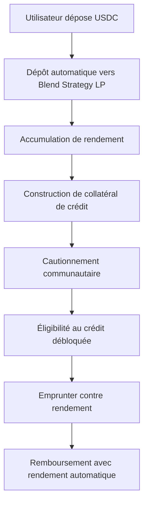

# Système de Crédit

Le système de crédit de Sozu Capital représente une approche révolutionnaire de la finance décentralisée, combinant la confiance communautaire, la génération automatisée de rendement et une expérience utilisateur transparente grâce à notre logique innovante de dépôt automatique.

## Vue d'ensemble

Sozu Credit révolutionne l'accès au crédit en éliminant les barrières traditionnelles tout en tirant parti d'une infrastructure DeFi de pointe. Notre système combine :

- **Authentification par clé d'accès** : Sécurité biométrique avec UX zéro mot de passe
- **Portefeuilles Stellar instantanés** : Portefeuilles auto-dépositaires créés en millisecondes
- **Coffres-forts de rendement à dépôt automatique** : Génération automatique de rendement de 10-20% APY sur les dépôts USDC
- **Réseau de confiance communautaire** : Système de cautionnement décentralisé remplaçant les scores de crédit
- **Portail éducatif** : Cours de littératie financière débloquant l'éligibilité au crédit
- **Intégration du protocole Blend** : Prêt institutionnel avec surcollatéralisation

## Le Portefeuille Sozu

### Création intelligente de portefeuille

Chaque utilisateur de Sozu Capital reçoit un **Portefeuille Sozu** - un portefeuille Stellar auto-dépositaire créé instantanément lors de l'inscription utilisant l'authentification par clé d'accès.

**Caractéristiques clés :**

- **Authentification par clé d'accès** : Connexion biométrique sans mot de passe à retenir ou stocker
- **Création instantanée** : Portefeuille généré en millisecondes utilisant l'infrastructure sécurisée de Turnkey
- **Support multi-actifs** : Support natif pour USDC et autres actifs Stellar
- **Auto-dépôt** : Clés privées chiffrées et gérées par l'utilisateur

**Implémentation technique :**

```typescript
// Création de portefeuille Turnkey avec authentification par clé d'accès
import { TurnkeyClient } from "@turnkey/sdk-server";

const turnkeyClient = new TurnkeyClient({
  apiBaseUrl: process.env.NEXT_PUBLIC_TURNKEY_API_BASE_URL,
  apiPublicKey: process.env.NEXT_PUBLIC_TURNKEY_API_PUBLIC_KEY,
  apiPrivateKey: process.env.TURNKEY_API_PRIVATE_KEY,
  defaultOrganizationId: process.env.NEXT_PUBLIC_TURNKEY_ORG_ID,
});

// Créer un portefeuille instantanément lors de l'inscription utilisateur
const wallet = await turnkeyClient.createWallet({
  walletName: `SozuWallet_${userId}`,
  accounts: [
    {
      curve: "ed25519",
      pathFormat: "BIP32",
      path: "m/44'/148'/{accountIndex}'", // Chemin Stellar
      addressFormat: "STELLAR",
    },
  ],
});
```

### Logique de coffre-fort à dépôt automatique

Le système révolutionnaire de **coffre-fort à dépôt automatique** optimise automatiquement les fonds pour un rendement maximum tout en maintenant une liquidité instantanée pour les opérations de crédit.

**Comment ça fonctionne :**

1. **Détection intelligente des dépôts** : Surveillance de l'API Stellar Horizon pour les transferts USDC entrants
2. **Allocation instantanée au coffre-fort** : 90% des fonds automatiquement déposés dans les coffres-forts de rendement Blend
3. **Réserve de liquidité** : 10% maintenus dans le portefeuille chaud pour un accès immédiat au crédit
4. **Synchronisation des soldes en temps réel** : Agrégation des soldes portefeuille + coffre-fort pour une expérience utilisateur unifiée
5. **Rééquilibrage dynamique** : Ajustement automatique des allocations basé sur les taux de rendement et les besoins de liquidité

**Optimisation du rendement :**

```typescript
// Logique d'allocation de coffre-fort à dépôt automatique
const VAULT_MIN_DEPOSIT = 10; // Dépôt minimum USDC pour le coffre-fort

function processIncomingUSDC(amount: number) {
  const vaultAmount = Math.max(amount * 0.9, VAULT_MIN_DEPOSIT);
  const reserveAmount = amount - vaultAmount;

  // Déposer dans le coffre-fort Blend pour 10-20% APY
  await blendVault.deposit(vaultAmount);

  // Maintenir la réserve de liquidité
  await stellarWallet.reserve(reserveAmount);

  // Mettre à jour le solde unifié
  await updateUserBalance(userId, {
    wallet: reserveAmount,
    vault: vaultAmount,
    totalYield: calculateProjectedYield(vaultAmount),
  });
}
```

**Avantages :**

- **APY passif de 10-20%** : Génération automatique de rendement sans effort utilisateur
- **Liquidité instantanée** : Les opérations de crédit puisent dans la réserve sans délais de retrait du coffre-fort
- **Vue de solde unifiée** : Solde unique montrant la valeur combinée portefeuille + coffre-fort
- **Gestion des risques** : Positions de coffre-fort surcollatéralisées avec protection contre la perte impermanente

## Intégration du protocole Blend

### Qu'est-ce que Blend ?

[Blend Protocol](https://docs.blend.capital/) est le principal protocole de prêt de Stellar, offrant :

- **Prêt surcollatéralisé** : Les utilisateurs déposent des actifs en garantie pour emprunter d'autres
- **Pools de liquidité** : Market making automatisé avec protection contre la perte impermanente
- **Opportunités à haut rendement** : APY compétitifs grâce à une provision stratégique de liquidité
- **Minimisation de la confiance** : Les smart contracts assurent l'intégrité du protocole

### Blend Strategy LP (Liquidity Pools)

Sozu Capital s'intègre avec le système **Strategy LP** de Blend, qui fournit des opportunités sophistiquées de yield farming :

**Caractéristiques Strategy LP :**

- **Rééquilibrage automatisé** : Les smart contracts ajustent automatiquement les positions
- **Protection contre la perte impermanente** : Mécanismes avancés minimisant les risques de PI
- **APY élevés** : Rendements annualisés de 10-20% sur les paires de stablecoins
- **Dépôts minimums bas** : Accessible aux utilisateurs avec n'importe quel montant de capital

**Comment fonctionnent les Strategy LP :**

```typescript
interface BlendStrategyLP {
  // Paramètres de rééquilibrage automatique
  targetAllocations: {
    stablecoinPool: 0.6; // 60% dans les paires stables
    volatilePool: 0.3; // 30% dans les paires à rendement plus élevé
    reservePool: 0.1; // 10% réserves liquides
  };

  // Déclencheurs de rééquilibrage
  triggers: {
    yieldThreshold: 0.15; // Rééquilibrer si le rendement tombe en dessous de 15%
    impermanentLossLimit: 0.05; // Tolérance PI
    liquidityRatio: 0.8; // Maintenir 80% de liquidité
  };
}
```

### Mécanismes de collatéralisation

Le prêt surcollatéralisé de Blend assure la stabilité du système :

**Exigences de collatéral :**

- **Ratio minimum** : 110% de collatéralisation pour l'emprunt
- **Seuil de liquidation** : 105% déclenche l'ajustement de position
- **Taux d'intérêt** : Dynamiques basés sur l'utilisation et les conditions du marché

**Intégration Sozu Credit :**

```typescript
// Structure de collatéral du pool de crédit
interface CreditCollateral {
  userDeposits: {
    usdc: amount; // USDC déposé par l'utilisateur
    blendLP: lpTokens; // Tokens Strategy LP
    yieldEarnings: accrued; // Rendement accumulé
  };

  creditTerms: {
    maxLoanToValue: 0.8; // Ratio LTV de 80%
    interestRate: dynamic; // Basé sur le score de confiance
    repaymentPeriod: 30; // Jours
  };
}
```

## Adéquation parfaite pour Sozu Capital

### Expérience utilisateur à faible friction

**Problèmes DeFi traditionnels résolus :**

- **Interfaces complexes** : Strategy LP de Blend abstraits derrière un dépôt automatique simple
- **Gestion manuelle** : Rééquilibrage et gestion de position automatisés
- **Minimums élevés** : Micro-dépôts supportés grâce à l'agrégation
- **Barrières techniques** : Aucune connaissance blockchain requise

### Amélioration du crédit basé sur la confiance

**Rendement = Collatéral de crédit :**

- **Accumulation automatique** : Chaque utilisateur construit du collatéral grâce au rendement passif
- **Multiplicateur de score de confiance** : Le cautionnement communautaire détermine les termes de crédit
- **Exigences éducatives** : Vérification des connaissances pour des limites plus élevées

### Atténuation des risques

**Sécurité multi-couches :**

- **Surcollatéralisation** : Minimum de 110% de Blend assure la solvabilité
- **Assurance de rendement** : Strategy LP incluent la protection contre la perte impermanente
- **Supervision communautaire** : Système de cautionnement empêchant le prêt imprudent
- **Auto-dépôt** : Les utilisateurs contrôlent leurs actifs à tout moment

## Parcours utilisateur

### Flux pour nouveau utilisateur

1. **Inscription** : Authentification par clé d'accès crée instantanément le Portefeuille Sozu
2. **Construction de confiance** : Recevoir des points de confiance initiaux, commencer le réseau de cautionnement
3. **Éducation** : Terminer les cours pour débloquer l'éligibilité au crédit
4. **Premier dépôt** : USDC entre automatiquement dans Strategy LP à haut rendement
5. **Accès au crédit** : Cautionnement communautaire permet l'emprunt contre rendement

### Opérations de crédit



## Architecture technique

### Couche d'intégration de portefeuille

```
Frontend (Next.js PWA)
    ↓
Couche API (Edge Runtime)
    ↓
├── Turnkey SDK (Gestion de portefeuille)
├── Stellar SDK (Opérations blockchain)
└── Blend SDK (Intégration DeFi)
    ↓
Réseau Stellar + Protocole Blend
```

### Implémentation du dépôt automatique

**Intégration smart contract :**

```solidity
// Logique de dépôt automatique simplifiée
contract SozuAutoDeposit {
    function onReceiveUSDC(uint256 amount) external {
        // 1. Accepter le dépôt USDC
        usdc.transferFrom(msg.sender, address(this), amount);

        // 2. Calculer l'allocation optimale
        uint256 yieldAmount = calculateYieldAllocation(amount);
        uint256 reserveAmount = amount - yieldAmount;

        // 3. Déposer vers Blend Strategy LP
        blendStrategyLP.deposit(yieldAmount);

        // 4. Mettre à jour le solde utilisateur
        updateUserBalance(msg.sender, amount);
    }
}
```

## Avantages pour les utilisateurs

### Inclusion financière

- **Aucun historique de crédit requis** : Système basé sur la confiance remplace les scores traditionnels
- **Barrières basses** : Commencer avec n'importe quel montant, construire progressivement
- **Focus éducatif** : Littératie financière comme prérequis de crédit

### Rendements supérieurs

- **Optimisation automatisée** : Toujours gagner le rendement maximum disponible
- **Croissance composée** : Rendement sur rendement grâce au réinvestissement continu
- **Risque faible** : Stratégies DeFi de qualité institutionnelle avec interface conviviale

### Expérience transparente

- **Opérations en un clic** : Déposer, emprunter, rembourser avec des actions uniques
- **Transparence en temps réel** : Suivi en direct du solde et du rendement
- **Mobile-first** : Design PWA pour accès en déplacement

## Améliorations futures

### Stratégies avancées

- **Intégration multi-protocoles** : Protocoles DeFi supplémentaires pour des rendements améliorés
- **Optimisation IA** : Apprentissage automatique pour le timing optimal des dépôts
- **Expansion cross-chain** : Opportunités de rendement multi-blockchain

### Fonctionnalités de crédit améliorées

- **Termes dynamiques** : Taux ajustés par IA basés sur le comportement utilisateur
- **Prêts flash** : Crédit instantané pour les opportunités d'arbitrage
- **Dérivés de crédit** : Instruments de crédit échangeables

---

**Prêt à expérimenter l'avenir du crédit ?** Rejoignez Sozu Capital et découvrez comment la confiance communautaire + le rendement automatisé crée le système de crédit le plus accessible jamais construit.
